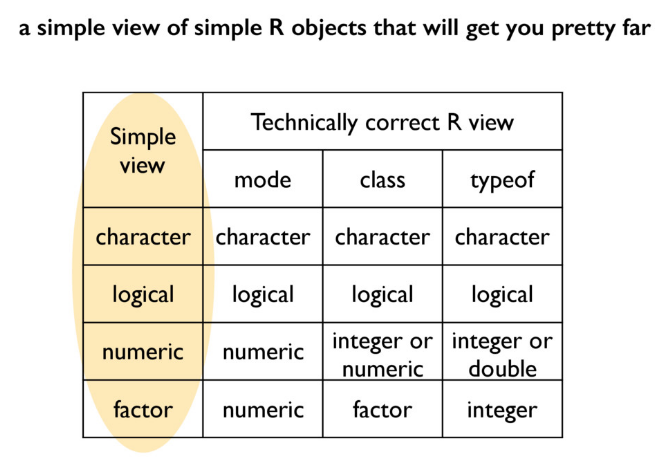

```{r setup, include=FALSE}
knitr::opts_chunk$set(echo = TRUE)
```



Fig 1: R Object type cheat table

# Summary:

* tidyverse is great.
* `str(obj)` : shows the structure of an R object.
* `names(df)` : gives the column names (variables) of a dataframe. Similarly, `ncol()` is equaivalent to `length()`. `nrow()` and `dim()` give number of rows and row x col dimensions of the dataframe. 
* `as_tibble(df)` : a much nicer summary of large dataframes.
* `summary(num_obj/df_col)` : do this to get a sense of scale and dist.
* plot(dep_var ~ indep_var, df)
* `%>%` : pipe operator. Think "then". Plugs the first preceding R object into the first argument of a function succeeding it (usually on a different line).
* `rename(df, NewColName = old_col_name)` : Rename columns. 
* `filter(df, col {operator} value)` : filters dataframe for the condition in the second argument. Can add more arguments if multiple filter conditions needed. `{operator}` can be `==`, `>=`, `<`, `!=`, `%in%` and the like.
* `x %in% y`: asks if x is contained in y. Not to be confused with `==` or `=`.
* `select(df, col/condition)` : Ditto `filter()`, with the added ability to subset a dataframe with only certain columns/variables.
* `mutate(df, new var/col = func)` : defines and inserts new column into the dataframe.
* Percentages and relative quantities hold much more meaning to humans than simply raw numbers.
* `rep(thing, x)` : Replicates (repeats) thing x times.
* `nlevels(x)` : Outputs the number of unique observations in the x column. Actually looks at the number of levels in a factor, each unique observation being given a unique level.
* Example:
```{r mut_rep, eval=FALSE}
ctib <- my_gap %>%
  filter(country == "Canada")
my_gap <- my_gap %>%
  mutate(tmp = rep(ctib$gdpPercap, nlevels(country)),
         gdpPercapRel = gdpPercap / tmp,
         tmp = NULL)
```
* Put `eval = False` to display code chunks that do not need output or throw errors without cause.
* `arrange(df, var/col)` : arranges dataframe with given variable in ascending order. Use `desc(var/col)` for descending order.
* Analysis code should never assume a particular row order for the data. Ordering rows is nice for human viewing, however.


bla
<http://rmarkdown.rstudio.com>.

**bold** *italics*