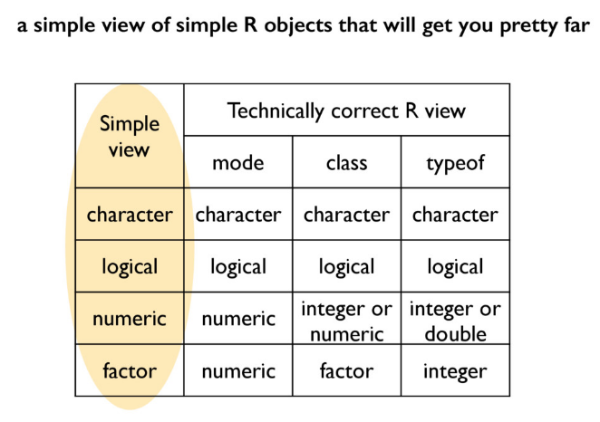
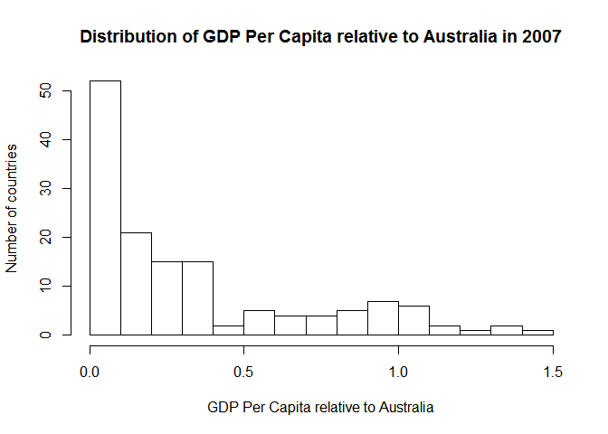

1.  Messin' with dataframes
================
Vivek Trivedi
2 February 2017



Fig 1: R Object type cheat table

Summary:
========

-   tidyverse and gapminder are awesome and thought provoking!
-   `str(obj)` : shows the structure of an R object.

``` r
str(gapminder)
```

    ## Classes 'tbl_df', 'tbl' and 'data.frame':    1704 obs. of  6 variables:
    ##  $ country  : Factor w/ 142 levels "Afghanistan",..: 1 1 1 1 1 1 1 1 1 1 ...
    ##  $ continent: Factor w/ 5 levels "Africa","Americas",..: 3 3 3 3 3 3 3 3 3 3 ...
    ##  $ year     : int  1952 1957 1962 1967 1972 1977 1982 1987 1992 1997 ...
    ##  $ lifeExp  : num  28.8 30.3 32 34 36.1 ...
    ##  $ pop      : int  8425333 9240934 10267083 11537966 13079460 14880372 12881816 13867957 16317921 22227415 ...
    ##  $ gdpPercap: num  779 821 853 836 740 ...

-   `names(df)` : gives the column names (variables) of a dataframe. Similarly, `ncol()` is equaivalent to `length()`. `nrow()` and `dim()` give number of rows and row x col dimensions of the dataframe.
-   `as_tibble(df)` : a much nicer summary of large dataframes.

``` r
as_tibble(gapminder)
```

    ## # A tibble: 1,704 × 6
    ##        country continent  year lifeExp      pop gdpPercap
    ##         <fctr>    <fctr> <int>   <dbl>    <int>     <dbl>
    ## 1  Afghanistan      Asia  1952  28.801  8425333  779.4453
    ## 2  Afghanistan      Asia  1957  30.332  9240934  820.8530
    ## 3  Afghanistan      Asia  1962  31.997 10267083  853.1007
    ## 4  Afghanistan      Asia  1967  34.020 11537966  836.1971
    ## 5  Afghanistan      Asia  1972  36.088 13079460  739.9811
    ## 6  Afghanistan      Asia  1977  38.438 14880372  786.1134
    ## 7  Afghanistan      Asia  1982  39.854 12881816  978.0114
    ## 8  Afghanistan      Asia  1987  40.822 13867957  852.3959
    ## 9  Afghanistan      Asia  1992  41.674 16317921  649.3414
    ## 10 Afghanistan      Asia  1997  41.763 22227415  635.3414
    ## # ... with 1,694 more rows

-   `summary(num_obj/df_col)` : do this to get a sense of scale and dist.
-   `plot(dep_var ~ indep_var, df)` : plot two numerical variables from a single dataframe. Syntax is flexible - no need to write df into the second argument if `df$col` used in the first argument. Similar for `boxplot`. `main` and `x/ylab` arguments for the heading and axes labels (respectively) can be added `x/ylim` arguments need to be defined as `c(lower limit, upper limit)` to work.

``` r
boxplot(gdpPercap~year, g, main="Worldwide GDP Per Capita distribution in 55 years (1952-2007)", 
    xlab="year", ylab="GDP Per Capita", ylim=c(0,57000)) ## g being a copy of the gapminder dataset.
```


-   `%>%` : pipe operator. Think "then". Plugs the first/preceding R object into the first argument of a function succeeding it (usually on a different line).
-   `rename(df, NewColName = old_col_name)` : Rename columns.
-   `filter(df, col {operator} value)` : filters dataframe for the condition in the second argument. Can add more arguments if multiple filter conditions needed. `{operator}` can be `==`, `>=`, `<`, `!=`, `%in%` and the like.
-   `x %in% y`: asks if x is contained in y. Not to be confused with `==` or `=`.
-   `select(df, col/condition)` : Ditto `filter()`, with the added ability to subset a dataframe with only certain columns/variables. Use `select(df, col/var, everything())` to bring a variable the left side of the dataframe. `everything()` without a preceding column name `selects` the entire dataframe.
-   `mutate(df, new var/col = func)` : defines and inserts new column into the dataframe.
-   Percentages and relative quantities hold much more meaning to humans than simply raw numbers.
-   `rep(thing, x)` : Replicates (repeats) thing x times.
-   `nlevels(x)` : Outputs the number of unique observations in the x column. Actually looks at the number of levels in a factor, each unique observation being given a unique level.

``` r
atib <- g %>%
  filter(country == "Australia")

a_rel <- g %>%
  mutate(tmp = rep(atib$gdpPercap, nlevels(country)),
         gdpPercapRel = gdpPercap / tmp, ## GDP Per Capita relative to Australia
         tmp = NULL) ## Delete the tmp column
```

-   `hist(num col/var, probablity = TRUE/FALSE)` : Generates a histogram of given numerical variable with the choice of displaying raw frequencies (default) or probability densities on the y-axis.

``` r
RelLatest <- a_rel %>%
  filter(year == "2007")

hist(RelLatest$gdpPercapRel, main = "Distribution of GDP Per Capita relative to Australia in 2007", 
     xlab = "GDP Per Capita relative to Australia", 
     ylab = "Number of countries", 
     breaks = c(0, 0.1, 0.2, 0.3, 0.4, 0.5, 0.6, 0.7, 0.8, 0.9, 1, 1.1, 1.2, 1.3, 1.4, 1.5))
```



-   Put `eval = False` to display code chunks that do not need output or throw errors without cause.
-   `arrange(df, var/col)` : arranges dataframe with given variable in ascending order. Use `desc(var/col)` for descending order.
-   Analysis code should never assume a particular row order for the data. Ordering rows is nice for human viewing, however.
-   `table(col/var)` : Builds a table with frequency of each observations for the specified column.
-   `group_by(col/var)` : Distributes the entire dataset into "buckets" allocated according to the levels of the specified variable/s (factor/s). Preferred over `table()` as this func allocates the rows by levels of the var/factor, which makes further analysis simpler. For instance, if `group_by(continent, year)`, imagine buckets labelled *"continent x, year y"* with the corresponding data for all observations for all combinations of the continent-year pairing allocated buckets accordingly.

``` r
g %>%
  group_by(continent) %>%
  summarize(n = n())
```

    ## # A tibble: 5 × 2
    ##   continent     n
    ##      <fctr> <int>
    ## 1    Africa   624
    ## 2  Americas   300
    ## 3      Asia   396
    ## 4    Europe   360
    ## 5   Oceania    24

-   `tally()` : "Tally" up the frequency of observations in each of the "buckets". Could be used the same way as `summarise(n=n())` in the above example.
-   `count()` : Count up the frequency of particular observations of a variable in a dataset. Basically, a substisute to `group_by(col/var)` and `tally()` combined.
-   `summarise(col = func)` : Ditto `tally()` if used with `n()` as the function defining the column `n`, however, with the added advantages of being able to add and define multiple columns after a comma, preferably on a new line, and also being able to define variables using `mean()`, `median()`, `var()`, `sd()`, `mad()`, `IQR()`, `min()` and `max()`.
-   `n_distinct(col/var)` : Tallies up the frequency of distinct values (levels) of the specified variable (factor) rather than simply the number of observations as with `n()`.

``` r
g %>%
  group_by(continent) %>%
  summarize(n = n(),
            n_countries = n_distinct(country))
```

    ## # A tibble: 5 × 3
    ##   continent     n n_countries
    ##      <fctr> <int>       <int>
    ## 1    Africa   624          52
    ## 2  Americas   300          25
    ## 3      Asia   396          33
    ## 4    Europe   360          30
    ## 5   Oceania    24           2

-   `summarise_each(funs(stat_funcs), col/vars...)` : Ditto `summarise()`, but can apply the given statistical functions to multiple variables.

``` r
g %>%
  filter(year == c(2002, 2007)) %>%
  group_by(continent, year) %>%
  summarise_each(funs(mean, median), lifeExp, gdpPercap)
```

    ## Source: local data frame [10 x 6]
    ## Groups: continent [?]
    ## 
    ##    continent  year lifeExp_mean gdpPercap_mean lifeExp_median
    ##       <fctr> <int>        <dbl>          <dbl>          <dbl>
    ## 1     Africa  2002     53.32523       2599.385        51.2355
    ## 2     Africa  2007     54.80604       3089.033        52.9265
    ## 3   Americas  2002     72.42204       9287.677        72.0470
    ## 4   Americas  2007     73.60812      11003.032        72.8990
    ## 5       Asia  2002     69.23388      10174.090        71.0280
    ## 6       Asia  2007     70.72848      12473.027        72.3960
    ## 7     Europe  2002     76.70060      21711.732        77.5365
    ## 8     Europe  2007     77.64860      25054.482        78.6085
    ## 9    Oceania  2002     79.74000      26938.778        79.7400
    ## 10   Oceania  2007     80.71950      29810.188        80.7195
    ## # ... with 1 more variables: gdpPercap_median <dbl>

-   `first(col/var)` : Returns the first value of the specified variable within a group bucket. **Caution:** Raw order of the observed values in the dataframe matters. Arrange data, and double-check before applying this function.

``` r
g %>%
  select(country, year, lifeExp) %>%
  filter(year > 1990) %>%
  group_by(country) %>%
  mutate(lifeGain = lifeExp - first(lifeExp)) %>%
  arrange(lifeGain)
```

    ## Source: local data frame [568 x 4]
    ## Groups: country [142]
    ## 
    ##         country  year lifeExp lifeGain
    ##          <fctr> <int>   <dbl>    <dbl>
    ## 1      Zimbabwe  2002  39.989  -20.388
    ## 2     Swaziland  2007  39.613  -18.861
    ## 3       Lesotho  2007  42.592  -17.093
    ## 4      Zimbabwe  2007  43.487  -16.890
    ## 5      Botswana  2002  46.634  -16.111
    ## 6       Lesotho  2002  44.593  -15.092
    ## 7     Swaziland  2002  43.869  -14.605
    ## 8      Zimbabwe  1997  46.809  -13.568
    ## 9  South Africa  2007  49.339  -12.549
    ## 10     Botswana  2007  50.728  -12.017
    ## # ... with 558 more rows

-   `min_rank(col) {operator} value` : Arranges all observations of the variable in ascending order and returns ranked observations as per the condition in the argument. Use `desc()` for maximum ranked observations. `top_n(1, wt = lifeExp)` works the same as `min_rank(lifeExp == 1)`.
-   `print(n=Inf)`: Print all rows of a given output instead of truncating it like in `as_tibble()`.

``` r
g %>%
  select(year, country, gdpPercap) %>%
  group_by(year) %>%
  filter(min_rank(desc(gdpPercap)) < 2 | min_rank(gdpPercap) < 2) %>% 
  arrange(year, gdpPercap) %>%
  print(n=Inf)
```

    ## Source: local data frame [24 x 3]
    ## Groups: year [12]
    ## 
    ##     year          country   gdpPercap
    ##    <int>           <fctr>       <dbl>
    ## 1   1952          Lesotho    298.8462
    ## 2   1952           Kuwait 108382.3529
    ## 3   1957          Lesotho    335.9971
    ## 4   1957           Kuwait 113523.1329
    ## 5   1962          Burundi    355.2032
    ## 6   1962           Kuwait  95458.1118
    ## 7   1967          Myanmar    349.0000
    ## 8   1967           Kuwait  80894.8833
    ## 9   1972          Myanmar    357.0000
    ## 10  1972           Kuwait 109347.8670
    ## 11  1977          Myanmar    371.0000
    ## 12  1977           Kuwait  59265.4771
    ## 13  1982          Myanmar    424.0000
    ## 14  1982     Saudi Arabia  33693.1753
    ## 15  1987          Myanmar    385.0000
    ## 16  1987           Norway  31540.9748
    ## 17  1992          Myanmar    347.0000
    ## 18  1992           Kuwait  34932.9196
    ## 19  1997 Congo, Dem. Rep.    312.1884
    ## 20  1997           Norway  41283.1643
    ## 21  2002 Congo, Dem. Rep.    241.1659
    ## 22  2002           Norway  44683.9753
    ## 23  2007 Congo, Dem. Rep.    277.5519
    ## 24  2007           Norway  49357.1902

-   `lag(col/var)`: Returns the next observed value of the group "bucket" variable vector. Opposite of `lead()`, which returns the previous value. **Caution:** Raw order of observed variable values matters.

``` r
g %>%
  select(year, country, gdpPercap) %>%
  group_by(country) %>%
  mutate(da_sigma = gdpPercap - lag(gdpPercap)) %>%
  filter(year > 1952) %>%
  group_by(year) %>%
  filter(min_rank(desc(da_sigma)) < 3) %>%
  arrange(year, da_sigma) %>%
  print(n=Inf)
```

    ## Source: local data frame [22 x 4]
    ## Groups: year [11]
    ## 
    ##     year           country  gdpPercap  da_sigma
    ##    <int>            <fctr>      <dbl>     <dbl>
    ## 1   1957       Switzerland  17909.490  3175.257
    ## 2   1957            Kuwait 113523.133  5140.780
    ## 3   1962             Libya   6757.031  3308.746
    ## 4   1962      Saudi Arabia  11626.420  3468.829
    ## 5   1967      Saudi Arabia  16903.049  5276.629
    ## 6   1967             Libya  18772.752 12015.721
    ## 7   1972      Saudi Arabia  24837.429  7934.380
    ## 8   1972            Kuwait 109347.867 28452.984
    ## 9   1977      Saudi Arabia  34167.763  9330.334
    ## 10  1977             Gabon  21745.573 10343.625
    ## 11  1982           Iceland  23269.607  3614.645
    ## 12  1982         Singapore  15169.161  3959.072
    ## 13  1987            Norway  31540.975  5242.339
    ## 14  1987  Hong Kong, China  20038.473  5477.942
    ## 15  1992         Singapore  24769.891  5908.360
    ## 16  1992            Kuwait  34932.920  6814.490
    ## 17  1997            Norway  41283.164  7317.503
    ## 18  1997         Singapore  33519.477  8749.585
    ## 19  2002 Equatorial Guinea   7703.496  4889.015
    ## 20  2002           Ireland  34077.049  9555.102
    ## 21  2007         Singapore  47143.180 11120.074
    ## 22  2007            Kuwait  47306.990 12196.884

bla <http://rmarkdown.rstudio.com>.

**bold** *italics*
