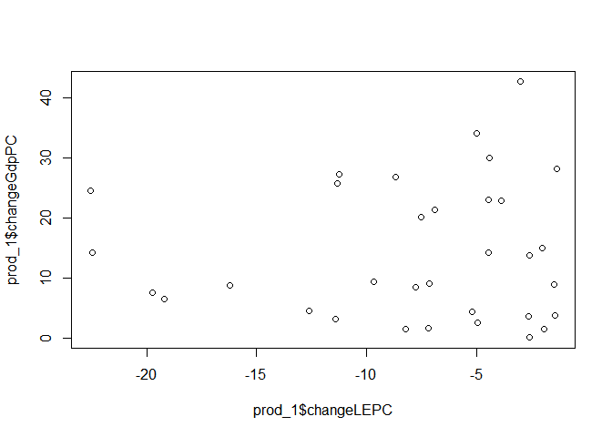
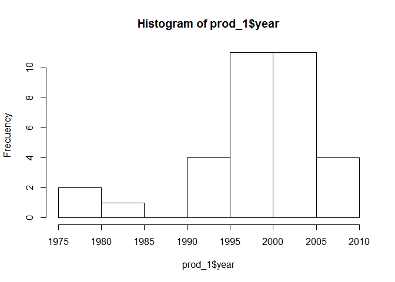
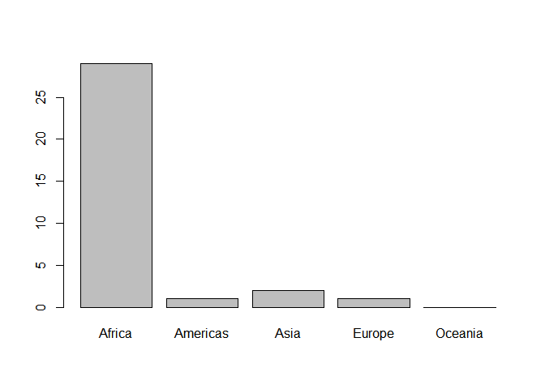
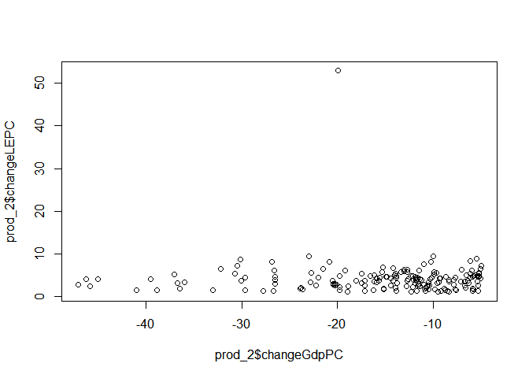
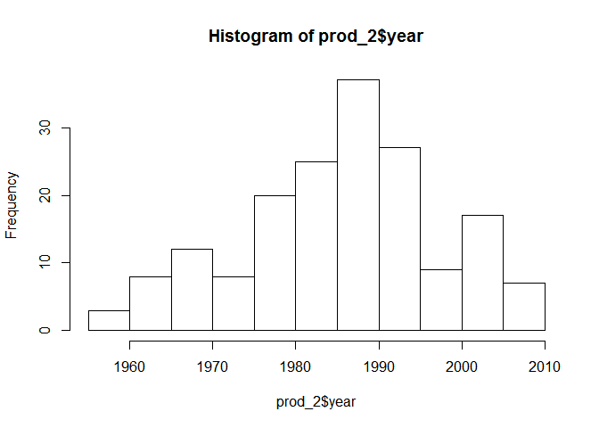
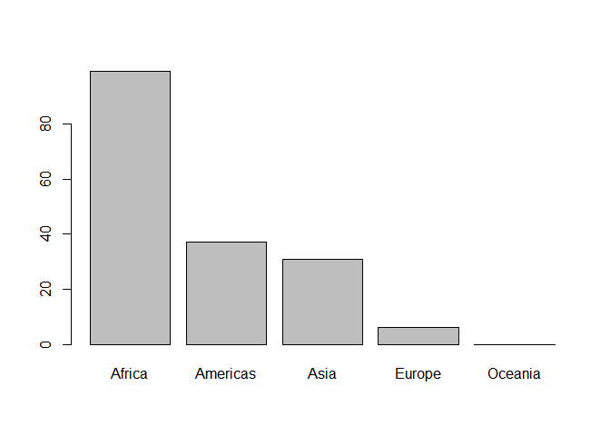

Demo: Messin' with dataframes
================
Vivek Trivedi
5 February 2017

Investigative question...
=========================

**Was there ever a country that did not have a correlational relationship between GDP per capita and life expectancy in a five year period between 1955 and 2007? If so, why did that occur? If not, why did this not occur in recent memory?**

Process
=======

Set up environment `-->` Data `-->` ascertain its order and arrangement `-->` group by continent, country `-->` add columns for change in GDP Per Capita and life expectency from previous five years `-->` verify `-->` make a new bare-bones copy of data `-->` filter for lack of coorelational relationship between the two `-->` ??? `-->` Profit.

The Magic
=========

``` r
rm(list=ls())
graphics.off()

library(gapminder)
library(tidyverse)

g <- gapminder
```

``` r
analysis_1 <- g %>%
  arrange(country, year) %>%
  group_by(continent, country) %>%
  mutate(changeGdpPC = ((gdpPercap - lag(gdpPercap))*100/lag(gdpPercap)),
         changeLEPC = ((lifeExp - lag(lifeExp))*100/lag(lifeExp))) # Brackets galore

options(tibble.width = Inf) # Shows all columns of a tibble... a bit ugly though.
analysis_1
```

    ## Source: local data frame [1,704 x 8]
    ## Groups: continent, country [142]
    ## 
    ##        country continent  year lifeExp      pop gdpPercap changeGdpPC
    ##         <fctr>    <fctr> <int>   <dbl>    <int>     <dbl>       <dbl>
    ## 1  Afghanistan      Asia  1952  28.801  8425333  779.4453          NA
    ## 2  Afghanistan      Asia  1957  30.332  9240934  820.8530    5.312459
    ## 3  Afghanistan      Asia  1962  31.997 10267083  853.1007    3.928557
    ## 4  Afghanistan      Asia  1967  34.020 11537966  836.1971   -1.981427
    ## 5  Afghanistan      Asia  1972  36.088 13079460  739.9811  -11.506381
    ## 6  Afghanistan      Asia  1977  38.438 14880372  786.1134    6.234248
    ## 7  Afghanistan      Asia  1982  39.854 12881816  978.0114   24.410993
    ## 8  Afghanistan      Asia  1987  40.822 13867957  852.3959  -12.843970
    ## 9  Afghanistan      Asia  1992  41.674 16317921  649.3414  -23.821623
    ## 10 Afghanistan      Asia  1997  41.763 22227415  635.3414   -2.156038
    ##    changeLEPC
    ##         <dbl>
    ## 1          NA
    ## 2   5.3157876
    ## 3   5.4892523
    ## 4   6.3224677
    ## 5   6.0787772
    ## 6   6.5118599
    ## 7   3.6838545
    ## 8   2.4288654
    ## 9   2.0871099
    ## 10  0.2135624
    ## # ... with 1,694 more rows

**Looking alright so far...**

Countries with a five yearly increase in GDP Per Capita and a decrease in life expectancy...
============================================================================================

``` r
finale_data <- analysis_1 %>%
  select(country, continent, year, changeGdpPC, changeLEPC)

prod_1 <- finale_data %>%
  filter(changeGdpPC > 0) %>%
  filter(changeLEPC < -1) %>% # Arbitary threshold to reduce noise
  arrange(changeLEPC)

print(prod_1, n = 50)
```

    ## Source: local data frame [33 x 5]
    ## Groups: continent, country [22]
    ## 
    ##          country continent  year changeGdpPC changeLEPC
    ##           <fctr>    <fctr> <int>       <dbl>      <dbl>
    ## 1       Cambodia      Asia  1977 24.51192323 -22.563683
    ## 2       Zimbabwe    Africa  1997 14.28125270 -22.472133
    ## 3        Lesotho    Africa  2002  7.50636358 -19.736132
    ## 4      Swaziland    Africa  2002  6.48345357 -19.193575
    ## 5       Botswana    Africa  1997  8.71286071 -16.238744
    ## 6        Namibia    Africa  2002  4.43132237 -12.612674
    ## 7   South Africa    Africa  2002  3.09870794 -11.406800
    ## 8        Liberia    Africa  1992 25.78650237 -11.352033
    ## 9       Botswana    Africa  2002 27.25134711 -11.267981
    ## 10     Swaziland    Africa  2007  9.33509649  -9.701612
    ## 11        Uganda    Africa  1997 26.76126967  -8.698413
    ## 12         Kenya    Africa  1997  1.38333702  -8.228051
    ## 13 Cote d'Ivoire    Africa  1997  8.38503814  -7.787641
    ## 14  South Africa    Africa  2007 20.21426780  -7.544271
    ## 15       Burundi    Africa  1992  1.58905755  -7.207899
    ## 16     Swaziland    Africa  1997  9.11184967  -7.157027
    ## 17       Lesotho    Africa  1997 21.34676746  -6.914635
    ## 18        Uganda    Africa  1992  4.28126040  -5.210740
    ## 19    Mozambique    Africa  2002 34.14273502  -5.001726
    ## 20       Namibia    Africa  1997  2.49665691  -4.983951
    ## 21      Cameroon    Africa  2002 14.14558696  -4.488592
    ## 22       Lesotho    Africa  2007 23.06700322  -4.487251
    ## 23    Mozambique    Africa  2007 29.99720493  -4.415573
    ## 24        Malawi    Africa  1997 22.91828702  -3.895184
    ## 25          Iraq      Asia  2002 42.73000821  -3.001139
    ## 26  South Africa    Africa  1997  3.51718408  -2.669338
    ## 27        Zambia    Africa  2002  0.02427956  -2.597048
    ## 28   El Salvador  Americas  1977 13.68678530  -2.595908
    ## 29          Chad    Africa  2002 15.04739526  -2.032071
    ## 30    Montenegro    Europe  2002  1.41643071  -1.940486
    ## 31         Gabon    Africa  1997  8.87938451  -1.474758
    ## 32       Eritrea    Africa  1982  3.78089919  -1.448299
    ## 33      Botswana    Africa  1992 28.17048848  -1.378454

Countries with a five yearly increase in Life Expectancy and an increase in GDP Per Capita...
=============================================================================================

``` r
finale_data <- analysis_1 %>%
  select(country, continent, year, changeGdpPC, changeLEPC)

prod_2 <- finale_data %>%
  filter(changeGdpPC < -5) %>% # Arbitary thresholds to reduce noise
  filter(changeLEPC > 1) %>%
  arrange(changeGdpPC)

print(prod_2, n = 50)
```

    ## Source: local data frame [173 x 5]
    ## Groups: continent, country [85]
    ## 
    ##                   country continent  year changeGdpPC changeLEPC
    ##                    <fctr>    <fctr> <int>       <dbl>      <dbl>
    ## 1                  Kuwait      Asia  1982   -47.09562   2.835182
    ## 2            Sierra Leone    Africa  1997   -46.22905   4.080035
    ## 3                  Kuwait      Asia  1977   -45.80098   2.408731
    ## 4                  Angola    Africa  1977   -45.03035   4.099873
    ## 5  Bosnia and Herzegovina    Europe  1992   -40.96630   1.459095
    ## 6                 Comoros    Africa  1977   -39.48098   4.076087
    ## 7                 Croatia    Europe  1992   -38.88411   1.407998
    ## 8            Saudi Arabia      Asia  1987   -37.08441   5.210119
    ## 9               Nicaragua  Americas  1982   -36.74620   3.180790
    ## 10     West Bank and Gaza      Asia  2002   -36.49700   1.791943
    ## 11                   Iran      Asia  1982   -36.00308   3.323975
    ## 12     West Bank and Gaza      Asia  2007   -33.00060   1.453641
    ## 13                  Libya    Africa  1987   -32.21376   6.562626
    ## 14             Mozambique    Africa  1977   -30.70666   5.373438
    ## 15                  Gabon    Africa  1982   -30.49913   7.149081
    ## 16               Zimbabwe    Africa  2007   -30.10680   8.747406
    ## 17                   Peru  Americas  1992   -30.09872   3.623663
    ## 18                   Chad    Africa  1982   -29.63680   4.503725
    ## 19                Lebanon      Asia  1987   -29.62401   1.407820
    ## 20          Guinea-Bissau    Africa  2002   -27.73561   1.406191
    ## 21                 Gambia    Africa  1987   -26.81840   8.084686
    ## 22                Burundi    Africa  1997   -26.68747   1.318848
    ## 23              Nicaragua  Americas  1992   -26.58447   6.184686
    ## 24               Ethiopia    Africa  1992   -26.56038   3.013881
    ## 25      Equatorial Guinea    Africa  1972   -26.56016   3.921820
    ## 26                  Niger    Africa  1987   -26.53801   4.594112
    ## 27               Slovenia    Europe  1992   -23.89812   1.923875
    ## 28            Afghanistan      Asia  1992   -23.82162   2.087110
    ## 29               Mongolia      Asia  1992   -23.63577   1.741888
    ## 30                 Jordan      Asia  1972   -23.01192   9.488853
    ## 31                 Jordan      Asia  1992   -22.86265   3.257982
    ## 32       Congo, Dem. Rep.    Africa  2002   -22.74990   5.586212
    ## 33                Ecuador  Americas  2002   -22.29519   2.573570
    ## 34                Liberia    Africa  2007   -22.00920   4.399698
    ## 35                  Gabon    Africa  1987   -21.49723   6.410438
    ## 36                  Libya    Africa  1982   -20.89605   8.204798
    ## 37                Bolivia  Americas  1957   -20.52944   3.652200
    ## 38                  Sudan    Africa  1987   -20.45454   2.793119
    ## 39                Nigeria    Africa  1982   -20.43329   2.947387
    ## 40               Djibouti    Africa  1997   -20.28218   3.009457
    ## 41                Liberia    Africa  1977   -20.25927   2.698644
    ## 42                  Haiti  Americas  1992   -20.11537   2.709001
    ## 43                 Rwanda    Africa  1997   -19.96071  52.917497
    ## 44                   Iraq      Asia  1987   -19.79855   4.845417
    ## 45              Argentina  Americas  2002   -19.78285   1.453429
    ## 46  Sao Tome and Principe    Africa  1987   -19.76982   2.281652
    ## 47                  Haiti  Americas  1967   -19.17697   6.086258
    ## 48    Trinidad and Tobago  Americas  1987   -18.98049   1.089609
    ## 49                Somalia    Africa  1982   -18.89641   2.337161
    ## 50                  Libya    Africa  1992   -18.09978   3.806202
    ## # ... with 123 more rows

Fishing for interesting crumbs...
=================================

``` r
plot(prod_1$changeGdpPC~prod_1$changeLEPC)
```



``` r
hist(prod_1$year)
```



``` r
plot(prod_1$continent) 
```



``` r
# hist() did not work for some reason, eventhough the continents
# are levels within the factor "continent".
```

``` r
plot(prod_2$changeLEPC~prod_2$changeGdpPC)
```



``` r
hist(prod_2$year)
```



``` r
plot(prod_2$continent)
```


